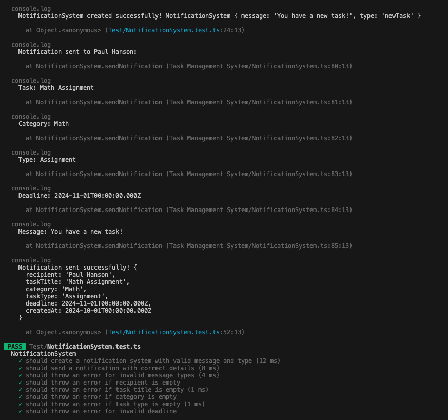
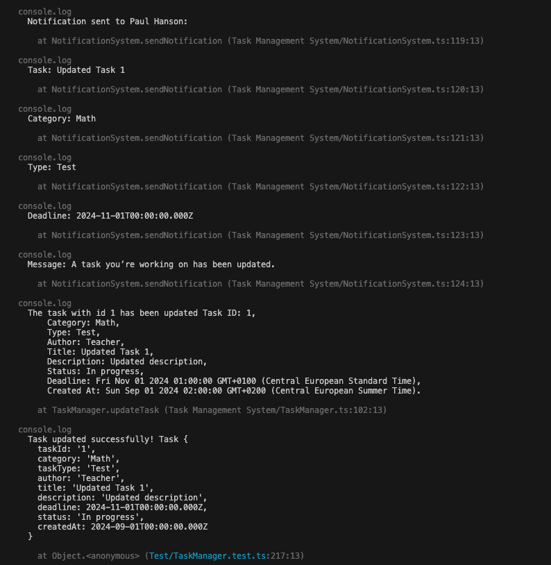
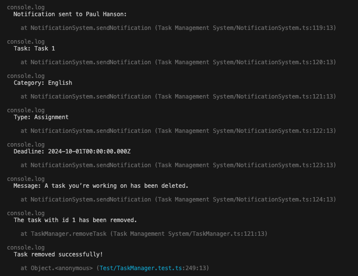
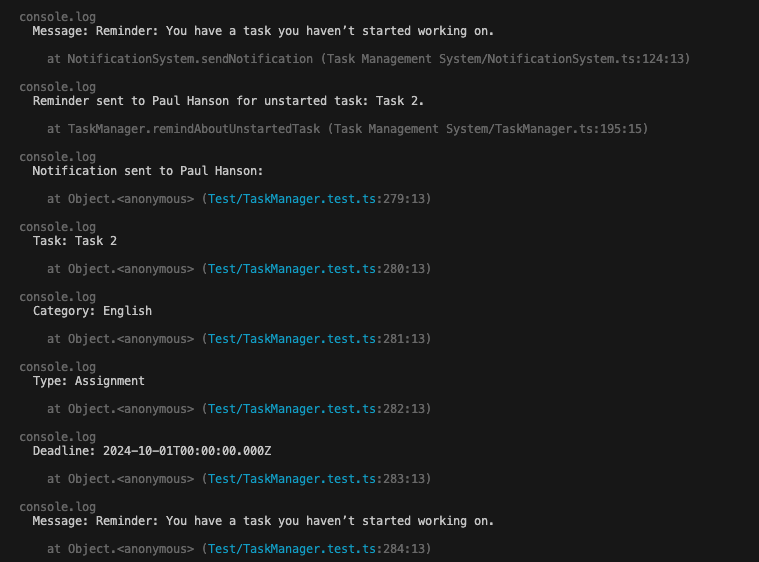

# Test Report for Task Management System

| Test Case | What is Being Tested | How it is Tested | Expected Outcome | Actual Outcome | Date Conducted | Result Image |
|-----------|----------------------|------------------|------------------|----------------|----------------|--------------|
| **1** | Create a task and assign it to a student | Create and assign a task to a student, then log the details | The task should be created and assigned to the student, and displayed in the console | Test failed initially, but passed after correction | 2024-09-26 |  |
| **2** | Create a user | Create a password and assign role to the user, then log the user details | The user should be created with a unique ID, a hashed password, and role should be assigned | The tests passed. User was created successfully | 2024-09-23 |  |
| **3** | Send notification to student | Create a notification system and send a notification with correct details | The notification should include the correct details and be sent to the corresponding user | The tests passed. Notification sent successfully | 2024-09-30 |  |
| **4** | Update and remove tasks | Update a task, then delete it using the unique task id | Tasks should be updated and removed successfully | The tests passed. Tasks were updated and removed | 2024-10-01 |   |
| **5** | Remind a student about unstarted task | Create a task older than a week and remind the student to start it | The student should receive a reminder about the unstarted task | The tests passed. Student received the reminder | 2024-10-01 |  |
| **6** | Remind a student about an upcoming deadline | Create a task with a deadline in two days, remind the student about the upcoming deadline | The student should receive a notification about the upcoming deadline | The tests passed. Student received the deadline reminder | 2024-10-01 |  |

## Test case 1: Create a task and assign it to a student

**What is being tested**:
Methods `createTask` and `assignTaskToStudent` in class `TaskManager`.

**How it is tested**:

1. Create a task with the following attributes:
 • ID: 1
 • Category: English
 • Type: Assignment
 • Author: Maria Johnson
 • Title: Task 1
 • Description: This is the first task
 • Deadline: 2024-10-01
 • Status: Not started
 • Created at: 2024-09-01

2. Assign the task to a student and log the task details.

3. Console log the task with the correct attributes and and the student it is assigned to.

**Expected outcome**:  
The task should be created and assigned to the student. The created task should be displayed in the console along the assigned student.

**Actual outcome**(before fixing):
Test failed. The order and number of variables were incorrect.

**After correcting**:
Task was successfully created and assigned to the student.

## Test case 2: Create a user

**What is being tested**:
Methods `createPassword` and `assignRole` in class `User`

**How it is tested**:

 1. Create a password for a user with the following attributes:
 • Name: Paul
 • Email: <paul.1@student.lnu.se>
 • Role: student

 2. Hash the password.

 3. Assign the role student to the user.

 4. Console log the user with the correct variables

**Expected outcome**:  
The user should be created with a unique ID, a hashed password, and the role should be assigned.

**Actual outcome**:
All tests passed. The user was created successfully, the password was hashed, and the role was assigned.

## Test case 3: Send notification to student

**What is being tested**:
Methods `notifyStudent` in class `TaskManager`

**How it is tested**:

Create a Notification System and...

1. Send a notification with the correct details
• Recipient: 'Paul Hanson',
• Task Title: 'Math Assignment',
• Category: 'Math',
• Task Type: 'Assignment',
• Deadline: new Date('2024-11-01'),
• Created At: new Date('2024-10-01'),

2. Console log the notification with the correct details

**Expected outcome**:  
The notfication should include the correct detail and be sent to the corresponding user.

**Actual outcome**:
All the tests passed and the notification was successfully sent with the correct details.

## Test case 4: Update and Remove Tasks

**What is being tested**:
Methods `removeTask`and `updateTask` in class `TaskManager`

**How it is tested**:

1. Use the unique task id to find task.

2. Update the task from:
• Task Id: '1',
• Task Category: 'English',
• Task Type: 'Assignment',
• Author: 'Maria Johnson',
• Title: 'Task 1',
• Description: 'This is the first task',
• Deadline: new Date('2024-11-01'),
• Task Status: 'Not started',
• Created At: new Date('2024-10-01'),
to:
• Task Id: '1',
• Task Category: 'Math',
• Task Type: 'Test',
• Author: 'Maria Johnson',
• Title: 'Updated Task 1',
• Description: 'Updated description',
• Deadline: new Date('2024-11-01'),
• Task Type: 'Not started',
• Created At: new Date('2024-10-01'),

3. Delete a task using the unique task id.

**Actual outcome**:

The tasks were updated and removed.

## Test case 5: Remind a student about an unstarted task

**What is being tested**:
Method `remindAboutUnstartedTask` in class `TaskManager`

**How it is tested**:

1. Create a task with a created at date older than one week.
2. Make sure the task does not have status `In progress`or `Completed`.
3. Call `remindAboutUnstartedTask`and make sure a reminder notification is sent to the student.

**Expected outcome**:

The student should get a reminder notification about the task through the notification system.

**Actual outcome**:
The tests passed. The student recieved a remeinder about the task.

## Test case 6: Remind a student about an up comming deadline

**What is being tested**:
Method `checkDeadlineApproaching` in class `TaskManager`

**How it is tested**:

1. Create a task created two days before deadline.
2. Make sure the task does not have status `Completed`.
3. Call `checkDeadlineApproaching` and make sure a reminder notification is sent to the student.

**Expected outcome**:

The student should get a reminder notification about the tasks deadline.

**Actual outcome**:

The test passes. The student gets a notification about the up comming deadline.

