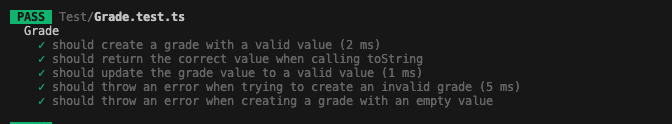

# Test Report for Task Management System

## Automatic test report

- **For viewing the latest tests, please visit this link**

- `https://beatrizsanssi.github.io/L2-Task-Manager/Report/test-report.html`

| Test Case | What is Being Tested |  Result | Date Conducted | Result Image |
|-----------|----------------------|---------|----------------|--------------|
| **1**     | Create a task and assign it to a student    | Passed | 2024-09-26     |                   |
| **2**     | Create a user                               | Passed | 2024-09-23     |                                         |
| **3**     | Send notification to student                | Passed | 2024-09-30     |                                                   |
| **4**     | Update and remove tasks                     | Passed | 2024-10-01     |   |
| **5**     | Remind a student about unstarted task       | Passed | 2024-10-01     |                                                 |
| **6**     | Remind a student about an upcoming deadline | Passed | 2024-10-01     |                                      |
| **7**     | List all tasks                              | Passed | 2024-10-02     |                                                      |
| **8**     | No available tasks                          | Passed | 2024-10-02     |                                                       |
| **9**     | Creating a task with the teacher not set    | Passed | 2024-10-02     |                                          |
| **10**    | Creating a task with an existing Id         | Passed | 2024-10-02     |                                                  |
| **11**    | Validate task type                          | Passed | 2024-10-02     |                                                  |
| **12**    | Validate task status                        | Passed | 2024-10-02     |                                                |
| **13**    | Empty task title                            | Passed | 2024-10-02     |                                                    |
| **14**    | Invalid Deadline                            | Passed | 2024-10-02     |                                                    |
| **15**    | Grade a task                                | Passed | 2024-10-22     |                                                |

## Test case 1: Create a task and assign it to a student

**What is being tested**:
Methods `createTask` and `assignTaskToStudent` in class `TaskManager`.

**How it is tested**:

1. Create a task with the following attributes:
   • ID: 1
   • Category: English
   • Type: Assignment
   • Author: Maria Johnson
   • Title: Task 1
   • Description: This is the first task
   • Deadline: 2024-10-01
   • Status: Not started
   • Created at: 2024-09-01

2. Assign the task to a student and log the task details.

3. Console log the task with the correct attributes and and the student it is assigned to.

**Expected outcome**:  
The task should be created and assigned to the student. The created task should be displayed in the console along the assigned student.

**Actual outcome**(before fixing):
Test failed. The order and number of variables were incorrect.

**After correcting**:
Task was successfully created and assigned to the student.

## Test case 2: Create a user

**What is being tested**:
Methods `createPassword` and `assignRole` in class `User`

**How it is tested**:

1. Create a password for a user with the following attributes:
   • Name: Paul
   • Email: <paul.1@student.lnu.se>
   • Role: student

2. Hash the password.

3. Assign the role student to the user.

4. Console log the user with the correct variables

**Expected outcome**:  
The user should be created with a unique ID, a hashed password, and the role should be assigned.

**Actual outcome**:
All tests passed. The user was created successfully, the password was hashed, and the role was assigned.

## Test case 3: Send notification to student

**What is being tested**:
Methods `notifyStudent` in class `TaskManager`

**How it is tested**:

Create a Notification System and...

1. Send a notification with the correct details
   • Recipient: 'Paul Hanson',
   • Task Title: 'Math Assignment',
   • Category: 'Math',
   • Task Type: 'Assignment',
   • Deadline: new Date('2024-11-01'),
   • Created At: new Date('2024-10-01'),

2. Console log the notification with the correct details

**Expected outcome**:  
The notfication should include the correct detail and be sent to the corresponding user.

**Actual outcome**:
All the tests passed and the notification was successfully sent with the correct details.

## Test case 4: Update and Remove Tasks

**What is being tested**:
Methods `removeTask`and `updateTask` in class `TaskManager`

**How it is tested**:

1. Use the unique task id to find task.

2. Update the task from:
   • Task Id: '1',
   • Task Category: 'English',
   • Task Type: 'Assignment',
   • Author: 'Maria Johnson',
   • Title: 'Task 1',
   • Description: 'This is the first task',
   • Deadline: new Date('2024-11-01'),
   • Task Status: 'Not started',
   • Created At: new Date('2024-10-01'),
   to:
   • Task Id: '1',
   • Task Category: 'Math',
   • Task Type: 'Test',
   • Author: 'Maria Johnson',
   • Title: 'Updated Task 1',
   • Description: 'Updated description',
   • Deadline: new Date('2024-11-01'),
   • Task Type: 'Not started',
   • Created At: new Date('2024-10-01'),

3. Delete a task using the unique task id.

**Actual outcome**:

The tasks were updated and removed.

## Test case 5: Remind a student about an unstarted task

**What is being tested**:
Method `remindAboutUnstartedTask` in class `TaskManager`

**How it is tested**:

1. Create a task with a created at date older than one week.
2. Make sure the task does not have status `In progress`or `Completed`.
3. Call `remindAboutUnstartedTask`and make sure a reminder notification is sent to the student.

**Expected outcome**:

The student should get a reminder notification about the task through the notification system.

**Actual outcome**:
The tests passed. The student recieved a remeinder about the task.

## Test case 6: Remind a student about an up comming deadline

**What is being tested**:
Method `checkDeadlineApproaching` in class `TaskManager`

**How it is tested**:

1. Create a task created two days before deadline.
2. Make sure the task does not have status `Completed`.
3. Call `checkDeadlineApproaching` and make sure a reminder notification is sent to the student.

**Expected outcome**:

The student should get a reminder notification about the tasks deadline.

**Actual outcome**:

The test passes. The student gets a notification about the up comming deadline.

## Test case 7: List all tasks

**What is being tested**:
Method `listTasks` in class `TaskManager`

**How it is tested**:

1. Create two tasks.
2. Assign the tasks to the student.
3. Call `listTasks`and make sure a list with the created tasks is displayed.

**Expected outcome**:

A list with the created tasks should be displayed.

**Actual outcome**:
The test passed. A list with the created tasks is displayed.

## Test case 8: No available tasks

**What is being tested**:
Method `listTasks` in class `TaskManager`

**How it is tested**:

1. No creation of tasks.
2. Call `listTasks`and make sure a log saying 'No tasks available' is displayed.

**Expected outcome**:

A log informing that there are no tasks available should be displayed.

**Actual outcome**:
The test passed. There are no tasks to list.

## Test case 9: Creating a task with the teacher not set

**What is being tested**:
Methods `createTask`, `addStudent` in class `TaskManager`

**How it is tested**:

1. Create a task with no teacher set.
2. Call `addStudent` and add a student to the task.
3. Call `createTask`.

**Expected outcome**:

An error is thrown saying 'Student or teacher must be set before creating a task'.

**Actual outcome**:
The test passed. Error is thrown.

## Test case 10: Creating a task with an existing Id

**What is being tested**:
Method `assignTaskToStudent` in `TaskManager`

**How it is tested**:

1. Create a task.
2. Call `assignTaskToStudent` and add the task, student and teacher.
3. Create a new task with the same Id as the previous one.
4. Call `assignTaskToStudent` and add the task, student and teacher.

**Expected outcome**:

An error is thrown saying 'A task with the ID 1 already exists'.

**Actual outcome**:
The test passed. Error is thrown.

## Test case 11: Validate task type

**What is being tested**:
Method `validateTaskType` in `Task`

**How it is tested**:

1. Create a task with an invalid task type

**Expected outcome**:

An error should be thrown saying 'Invalid task type'.

**Actual outcome**:
The test passed. Error is thrown.

## Test case 12: Validate task status

**What is being tested**:
Method `validateStatus` in `Task`

**How it is tested**:

1. Create a task with an invalid status.

**Expected outcome**:

An error should be thrown saying 'Invalid status'.

**Actual outcome**:
The test passed. Error is thrown.

## Test case 13: Empty task title

**What is being tested**:
Method `validateNotEmpty` in `Task`

**How it is tested**:

1. Create a task without a title.

**Expected outcome**:

An error should be thrown saying 'Title cannot be empty'.

**Actual outcome**:
The test passed. Error is thrown.

## Test case 14: Invalid Deadline

**What is being tested**:
Method `validateNotEmpty` in `Task`

**How it is tested**:

1. Create a task with an invalid deadline.

**Expected outcome**:

An error should be thrown saying 'Invalid deadline'.

**Actual outcome**:
The test passed. Error is thrown.

## Test case 15: Invalid Grade Value

**What is being tested**:
Method `setGradeValue` in `Grade`

**How it is tested**:

1. Create a task with an invalid grade value.

**Expected outcome**:

An error should be thrown saying 'Invalid grade value'.

**Actual outcome**:
The test passed. Error is thrown.

